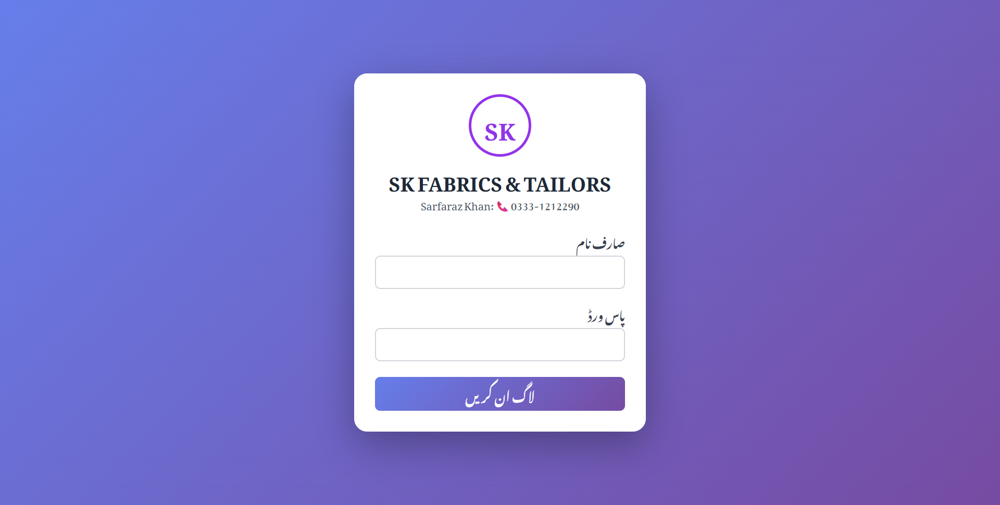
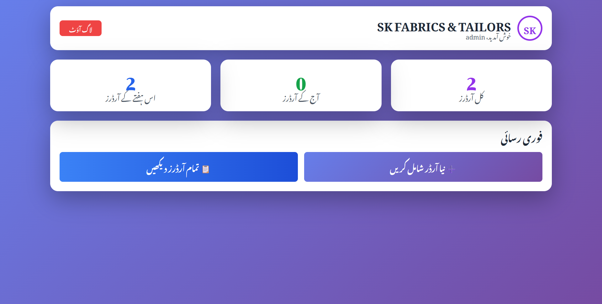
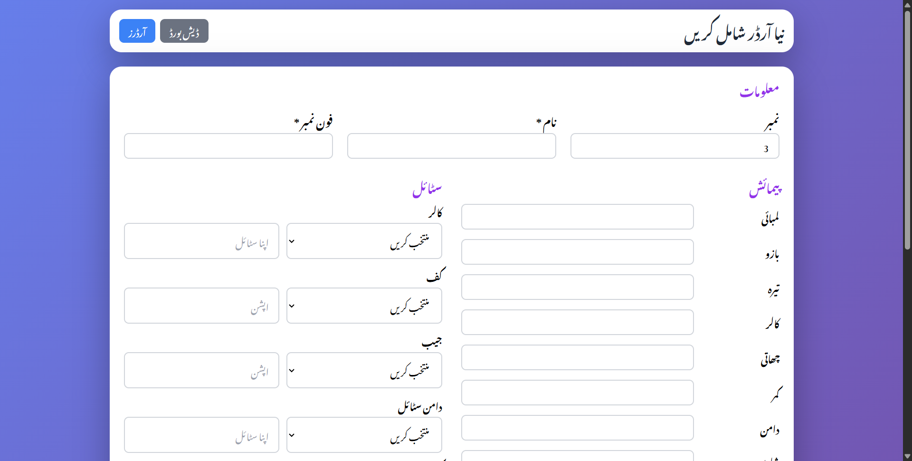
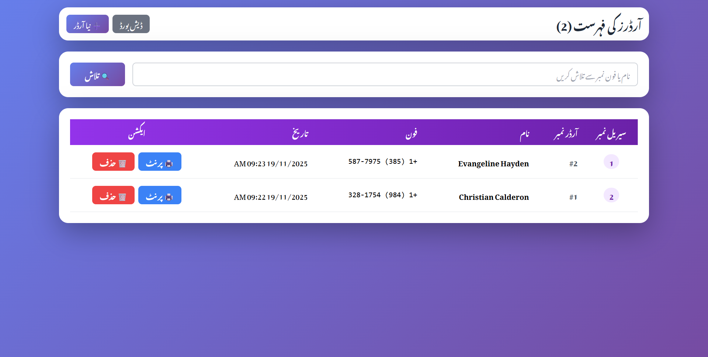
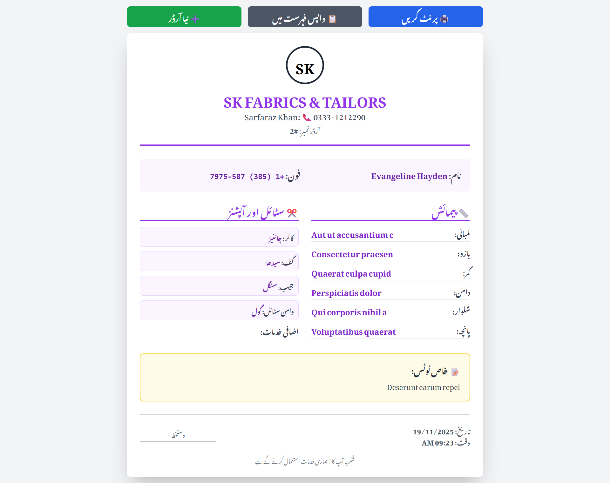
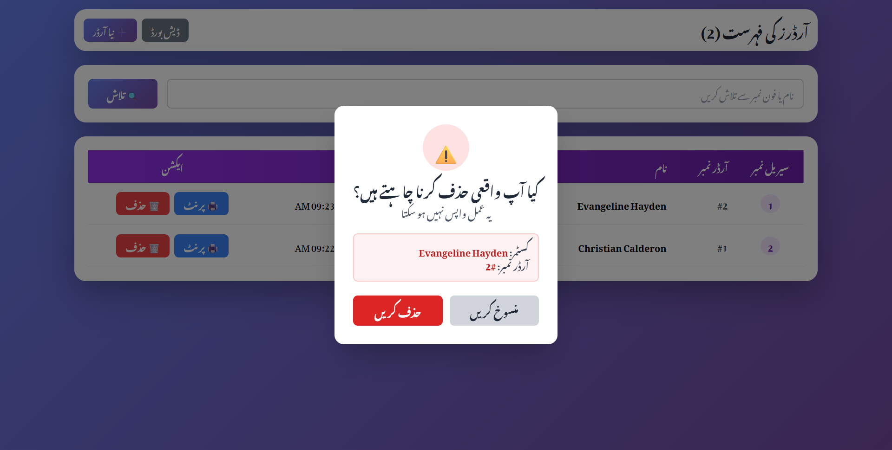

# 🧵 SK Fabrics & Tailors Management System

A complete professional tailor shop management system built with PHP, MySQL, and modern UI design. Perfect for managing customer orders, measurements, and printing invoices.


## ✨ Features

- 🔐 **Secure Authentication** - Password hashing & session management
- 📊 **Dashboard** - Real-time statistics (today, weekly, total orders)
- 📝 **Order Management** - Easy form with all measurements & styles
- 🔍 **Search & Filter** - Find orders by customer name or phone
- 📄 **Pagination** - 20 orders per page for better performance
- 🖨️ **Print Invoice** - Professional print-ready receipts
- 🗑️ **Delete Orders** - With confirmation modal for safety
- 🎨 **Modern UI** - Beautiful purple gradient theme with Tailwind CSS
- 📱 **Responsive Design** - Works on desktop, tablet, and mobile
- 🇵🇰 **RTL Support** - Full Urdu language support

## 📸 Screenshots
### Login


### Dashboard


### Add Order Form


### Orders List


### Print Order


### Delete Order


## 🚀 Quick Start

### Prerequisites
- PHP 7.4 or higher
- MySQL 5.7 or higher
- Apache/Nginx server
- XAMPP/WAMP (recommended for local development)

### Installation

1. **Clone the repository**
   ```bash
   git clone https://github.com/hilalahmad0101/tailors-management-system.git
   cd tailors-management-system
   ```

2. **Import Database**
   - Open phpMyAdmin
   - Create a new database named `tailor_system`
   - Import the `database.sql` file

3. **Configure Database**
   - Open `config.php`
   - Update database credentials if needed:
   ```php
   define('DB_HOST', 'localhost');
   define('DB_NAME', 'tailor_system');
   define('DB_USER', 'root');
   define('DB_PASS', 'root');
   ```

4. **Start Server**
   - Start Apache and MySQL in XAMPP/WAMP
   - Visit: `http://localhost/tailors-management-system/login.php`

5. **Login**
   - **Username:** `admin`
   - **Password:** `admin123`

## 📁 Project Structure

```
tailors-management-system/
├── config.php           # Database configuration
├── login.php           # Login page
├── dashboard.php       # Main dashboard
├── add_order.php       # Add new order form
├── list_orders.php     # View all orders
├── print_order.php     # Print invoice
├── logout.php          # Logout handler
└── database.sql        # Database schema
```

## 🛠️ Tech Stack

- **Backend:** PHP 7.4+
- **Database:** MySQL with PDO
- **Frontend:** HTML5, Tailwind CSS
- **Font:** Noto Nastaliq Urdu (Google Fonts)
- **Icons:** Unicode Emojis

## 📋 Database Schema

### Users Table
- `id` - Primary key
- `username` - Unique username
- `password` - Hashed password
- `full_name` - Full name
- `created_at` - Timestamp

### Orders Table
- Customer info (name, phone)
- Measurements (lambai, bazu, tera, collar, chati, kamar, daman, shalwar, pancha)
- Style options (collar, cuff, pocket, daman style, kurta)
- Additional services (8 checkboxes)
- Notes field
- Timestamps

## 🔒 Security Features

- ✅ Password hashing with `password_hash()`
- ✅ PDO prepared statements (SQL injection prevention)
- ✅ Session-based authentication
- ✅ Input sanitization with `htmlspecialchars()`
- ✅ CSRF protection ready

## 🎯 Key Functionalities

### Order Management
- Auto-increment order numbers
- Comprehensive measurement fields
- Style selection dropdowns with custom input
- 8 additional service checkboxes
- Notes section for special instructions

### Search & Filter
- Search by customer name
- Search by phone number
- Paginated results (20 per page)

### Print System
- Professional invoice layout
- Customer details
- All measurements and styles
- Checkbox selections displayed
- Date and time stamp
- Business header and footer

## 🤝 Contributing

Contributions are welcome! Please feel free to submit a Pull Request.

1. Fork the project
2. Create your feature branch (`git checkout -b feature/AmazingFeature`)
3. Commit your changes (`git commit -m 'Add some AmazingFeature'`)
4. Push to the branch (`git push origin feature/AmazingFeature`)
5. Open a Pull Request

## 📝 License

This project is licensed under the MIT License - see the [LICENSE](LICENSE) file for details.

## 👨‍💻 Author

**Hilal Ahmad**
- GitHub: [@hilalahmad0101](https://github.com/hilalahmad0101)

## 🙏 Acknowledgments

- Tailwind CSS for the beautiful UI framework
- Google Fonts for Noto Nastaliq Urdu
- SK Fabrics & Tailors for inspiration

## 📞 Support

For support, email hilalahmad0101@gmail.com or create an issue in this repository.

---

⭐ Star this repo if you find it helpful!

Made with ❤️ by Hilal Ahmad
